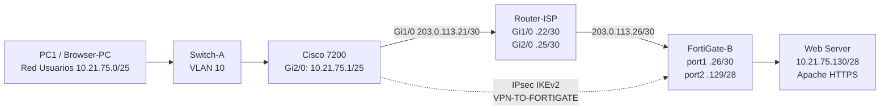
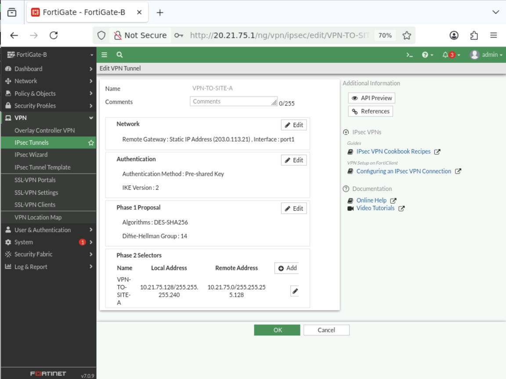
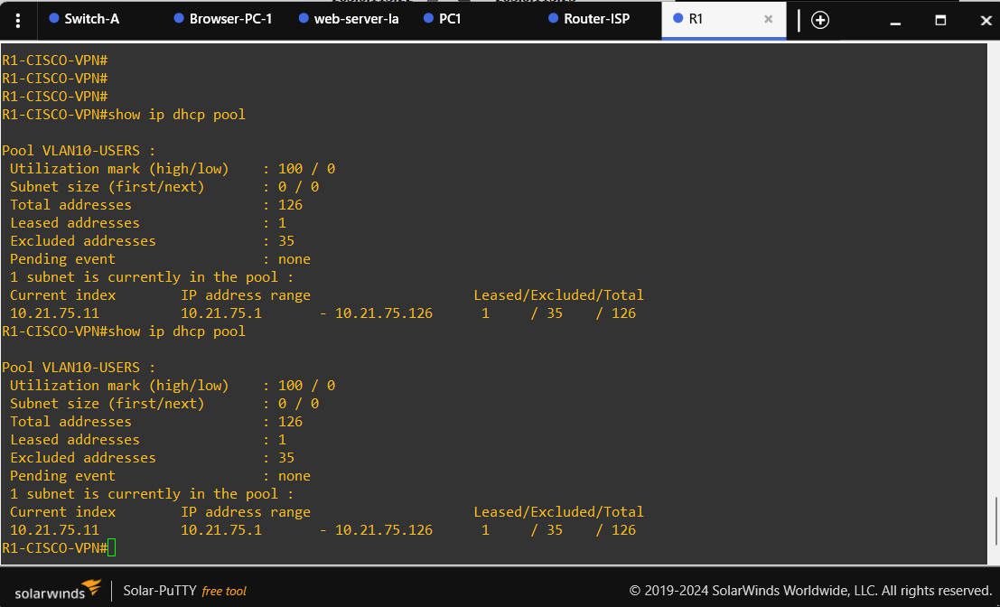
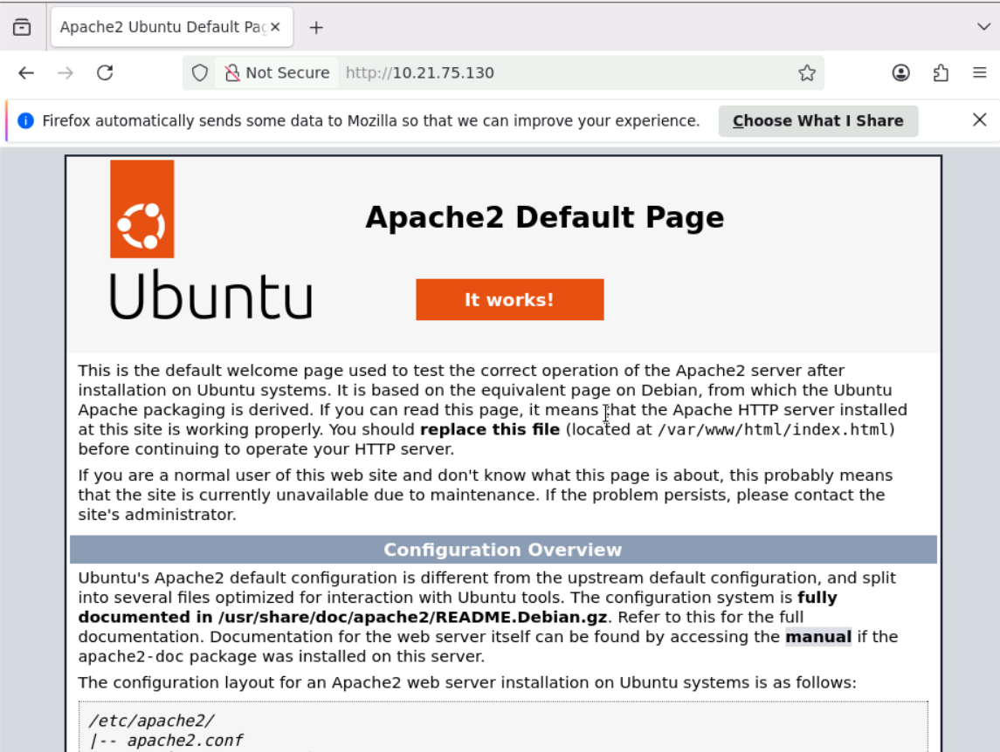
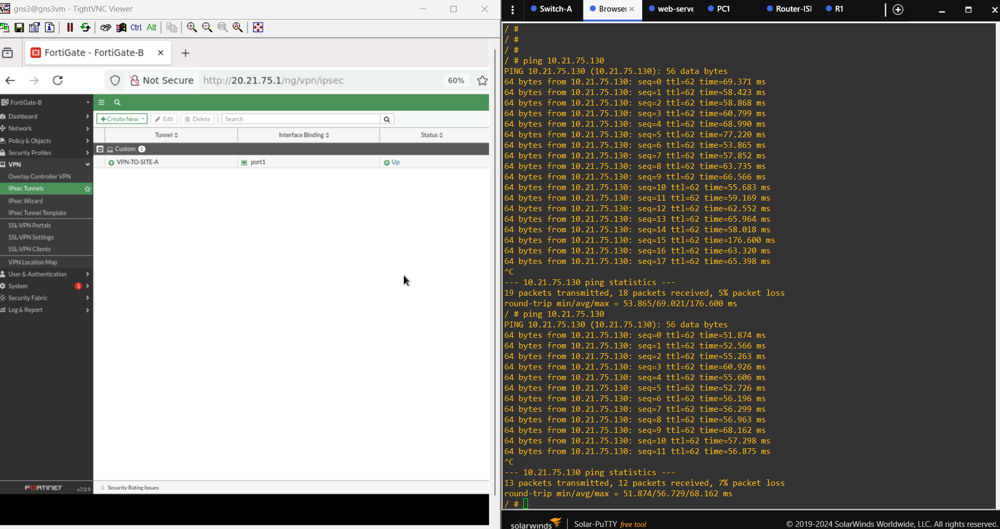
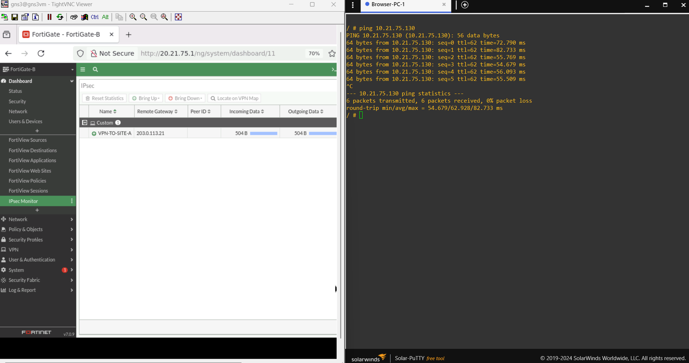

<h1 align="center">🔐 VPN Site-to-Site IPsec — Cisco 7200 ↔ FortiGate</h1>

<p align="center">
  <a href="https://github.com/fredcastillo/vpn-site-to-site-ipsec"></a>
  <a href="https://github.com/fredcastillo/vpn-site-to-site-ipsec"></a>
  <a href="https://github.com/fredcastillo/vpn-site-to-site-ipsec"></a>
  <a href="https://github.com/fredcastillo/vpn-site-to-site-ipsec"></a>
  <a href="https://github.com/fredcastillo/vpn-site-to-site-ipsec"></a>
  <a href="https://github.com/fredcastillo/vpn-site-to-site-ipsec"></a>
</p>

<div align="center">

> **Estudiante:** Fred Sneyder Castillo Apolinar | **Matrícula:** 2025-2175 | **Asignatura:** Seguridad de Redes |
> |**Entorno:** GNS3 |

</div>

## 🎥 VIDEO DEMOSTRATIVO

<div align="center">
  <a href="https://www.youtube.com/watch?v=L-i-9bDIgqg">
    
  </a>
</div>

---

## Propósito del laboratorio

Este laboratorio implementa una comunicación segura entre una red de usuarios y una red de servidores mediante un enlace VPN Site-to-Site entre un **Cisco 7200** y un **FortiGate**.

El laboratorio debe demostrar dos estados funcionales:

1. Con la VPN activa, el usuario puede comunicarse con el Web Server remoto.
2. Con el túnel VPN administrativamente deshabilitado, esa comunicación deja de estar disponible.
3. Al volver a habilitar la VPN, la comunicación se restablece.

La arquitectura utiliza un **Cisco 7200** como peer IPsec del **FortiGate-B**. El Cisco realiza funciones de red, DHCP, NAT y VPN; el FortiGate se configura y demuestra mediante su GUI, según el requisito de la práctica.

---

## Requisitos de la asignación cubiertos

| Requisito | Implementación |
|---|---|
| 1 FortiGate | FortiGate-B |
| Configuración FortiGate por GUI | ✅ |
| Configuración de red | ✅ |
| NAT | ✅ |
| VPN Site-to-Site | ✅ |
| 1 equipo de red | Cisco 7200 |
| Configuración de red Cisco | ✅ |
| NAT Cisco | ✅ |
| VPN Site-to-Site Cisco | ✅ |
| ISP / IP públicas simuladas | Router-ISP |
| Web Server `/28` | `10.21.75.130/28`, Apache/HTTPS |
| Usuarios `/25` | `10.21.75.0/25` |
| VLAN 10 | Switch-A |
| DHCP | Cisco 7200 |
| Traceroute hacia servidor | Browser-PC |
| Imágenes | Carpeta `images/` |
| Diagrama | Mermaid + captura GNS3 |
| Running-configs | Carpeta `configs/` |
| Scripts / comandos utilizados | Carpeta `scripts/` |

---

## Topología

### Captura real de GNS3


### Diagrama lógico



### Flujo de datos esperado

```text
Usuario
  │
  │ VLAN 10 / 10.21.75.0/25
  ▼
Cisco 7200
  │
  │ IPsec Site-to-Site
  │ 203.0.113.21 ↔ 203.0.113.26
  ▼
FortiGate-B
  │
  │ 10.21.75.128/28
  ▼
Web Server 10.21.75.130
```

---

## 🌐 Tabla de direccionamiento

### Sitio A — Usuarios / Cisco

| Elemento | Interfaz | Dirección | Uso |
|---|---|---:|---|
| Cisco 7200 | `GigabitEthernet1/0` | `203.0.113.21/30` | WAN |
| Cisco 7200 | `GigabitEthernet2/0` | `10.21.75.1/25` | Gateway de usuarios |
| PC1 / Browser-PC | LAN | DHCP | Usuario / pruebas |
| Red usuarios | — | `10.21.75.0/25` | VLAN 10 |

### Sitio B — FortiGate / Servidor

| Elemento | Interfaz | Dirección | Uso |
|---|---|---:|---|
| FortiGate-B | `port1` | `203.0.113.26/30` | WAN |
| FortiGate-B | `port2` | `10.21.75.129/28` | Gateway del servidor |
| Web Server | LAN | `10.21.75.130/28` | Apache / HTTPS |
| Red servidor | — | `10.21.75.128/28` | LAN remota |

### Tránsito ISP

| Dispositivo | Interfaz | Dirección |
|---|---|---:|
| Router-ISP | `GigabitEthernet1/0` | `203.0.113.22/30` |
| Router-ISP | `GigabitEthernet2/0` | `203.0.113.25/30` |

---

## 🔐 Diseño de la VPN

### Cisco 7200

- Peer remoto: `203.0.113.26`
- IKEv2
- Encryption: `DES`
- Integrity / Hash: `SHA256`
- DH Group: `14`
- Autenticación: Pre-Shared Key
- PFS: **Group 14**
- Transform Set: `esp-des esp-sha256-hmac`
- Local selector: `10.21.75.0/25`
- Remote selector: `10.21.75.128/28`
- Crypto Map: `FGT-VPN-MAP`

### FortiGate-B

- Remote Gateway: `203.0.113.21`
- IKEv2
- Phase 1: `DES-SHA256`, DH14
- Phase 2: `DES-SHA256`
- PFS: habilitado, Group 14
- Local selector: `10.21.75.128/28`
- Remote selector: `10.21.75.0/25`
- Túnel lógico: `VPN-TO-SITE-A`

> La PSK no se publica en este repositorio.



---

## Routing

### Cisco 7200

Ruta por defecto:

```text
0.0.0.0/0 → 203.0.113.22
```

El tráfico que coincide con `VPN-TRAFFIC` entra al crypto map aplicado en `GigabitEthernet1/0`.

### FortiGate-B

Ruta hacia la red del Cisco:

```text
10.21.75.0/25 → VPN-TO-SITE-A
```

En esta implementación se conservó el esquema de ruta utilizado durante el laboratorio, con el peer WAN del Cisco como gateway asociado y la interfaz IPsec como interfaz de salida. La validez del camino se demostró mediante las pruebas de conectividad realizadas en GNS3.

---

## 🛡️ NAT

### Cisco 7200

La ACL de NAT contiene dos comportamientos:

```text
deny   10.21.75.0/25 → 10.21.75.128/28
permit 10.21.75.0/25 → cualquier destino
```

Luego se aplica PAT sobre `GigabitEthernet1/0` mediante overload.

Esto mantiene el tráfico hacia el servidor remoto fuera del NAT y utiliza NAT/PAT para la salida general a Internet.

### FortiGate-B

La política de tráfico VPN mantiene NAT desactivado. La política `WEBSERVER_A_INTERNET` utiliza NAT para la salida del Web Server hacia `port1`.


---

## 🖧 VLAN 10 y DHCP

La red de usuarios utiliza **VLAN 10** en Switch-A.

El running-config del switch confirma que los puertos `GigabitEthernet0/0`, `GigabitEthernet0/1` y `GigabitEthernet0/2` están en modo access y pertenecen a VLAN 10.

El DHCP de la red de usuarios se habilitó en el Cisco 7200:

- Pool: `VLAN10-USERS`
- Red: `10.21.75.0/25`
- Gateway: `10.21.75.1`
- DNS: `8.8.8.8`
- Exclusiones: `.1–.9` y `.101–.126`
- Rango efectivo para clientes: `.10–.100`



---

## 🌐 Web Server

El recurso remoto es un servidor Debian que ejecuta Apache para proporcionar el servicio HTTPS.

| Parámetro | Valor |
|---|---|
| Sistema | Debian |
| IP | `10.21.75.130/28` |
| Gateway | `10.21.75.129` |
| Servicio | Apache |
| Protocolo demostrado | HTTPS |



---

## Validación funcional

### 1. VPN activa

Se verificó que el túnel aparece **UP** en el IPsec Monitor del FortiGate.

En el Cisco se obtuvo una IKEv2 SA en estado `READY`, con:

- DES
- SHA256
- DH14
- PSK

Además, la salida de `show crypto ipsec sa` mostró paquetes encapsulados, cifrados, decapsulados y descifrados.


### 2. Comunicación Usuario → Web Server

Desde el equipo de pruebas se alcanzó:

```text
10.21.75.130
```

La prueba ICMP fue exitosa después del establecimiento de la SA.



### 3. HTTPS

El Browser-PC pudo acceder al servidor mediante HTTPS con la VPN activa.


### 4. Traceroute

Resultado real obtenido desde el Browser-PC:

```text
traceroute to 10.21.75.130 (10.21.75.130), 30 hops max, 46 byte packets
 1  10.21.75.1 (10.21.75.1)  47.787 ms  12.565 ms  15.915 ms
 2  *  *  *
 3  10.21.75.130 (10.21.75.130)  61.864 ms  59.576 ms  62.353 ms
```


### 5. VPN deshabilitada

Para la comprobación exigida por la asignación se deshabilitó administrativamente la interfaz de túnel `VPN-TO-SITE-A` desde la GUI del FortiGate.

Con el túnel deshabilitado, la comunicación con `10.21.75.130` dejó de estar disponible.


### 6. VPN restaurada

Al volver a habilitar la interfaz del túnel, la comunicación con el Web Server se restableció.



---

## 📸 Evidencias mínimas

evidencias fundamentales:

| Archivo | Evidencia |
|---|---|
| `01-topology-gns3.png` | Topología GNS3 |
| `02-vpn-fortigate-b.png` | VPN en FortiGate-B |
| `03-policies-fortigate-b.png` | Policies y NAT |
| `04-vlan-dhcp.png` | VLAN 10 / DHCP |
| `05-webserver-https.png` | Web Server HTTPS |
| `06-cisco-ipsec-status.png` | IKEv2 / IPsec / PFS |
| `07-connectivity-vpn-up.png` | Usuario → servidor con VPN activa |
| `08-traceroute.png` | Traceroute |
| `09-vpn-disabled-failure.png` | Comunicación bloqueada con VPN deshabilitada |
| `10-vpn-restored.png` | Comunicación restaurada |

---

## 📂 Running-Configs

- [Cisco 7200 — configuración reconstruida desde el transcript de comandos](configs/Cisco-R1/running-config-reconstructed.txt)
- [FortiGate-B — secciones relevantes verificadas](configs/FortiGate-B/running-config-relevant-final.txt)
- [Router-ISP — running-config](configs/Router-ISP/running-config.txt)
- [Switch-A — running-config](configs/Switch-A/running-config.txt)

---

## 📜 Scripts y comandos utilizados

- [Configuración del Cisco 7200 — transcript/plantilla](scripts/cisco-7200-config.txt)
- [Comandos de verificación](scripts/verification-commands.txt)
- [Configuración GUI del FortiGate — checklist](scripts/fortigate-gui-checklist.md)

La configuración funcional del FortiGate se realizó mediante GUI. No se presenta una recreación CLI como si hubiese sido el método de despliegue del FortiGate.

---

## 👨‍💻 Autor

**Fred Castillo**  
*Estudiante de Tecnólogo en Seguridad Informática*  
*Aspirante a Red Team | Seguridad Ofensiva*

[](https://www.linkedin.com/in/fredcastillo11/)
[](https://github.com/fredcastillo)

---
